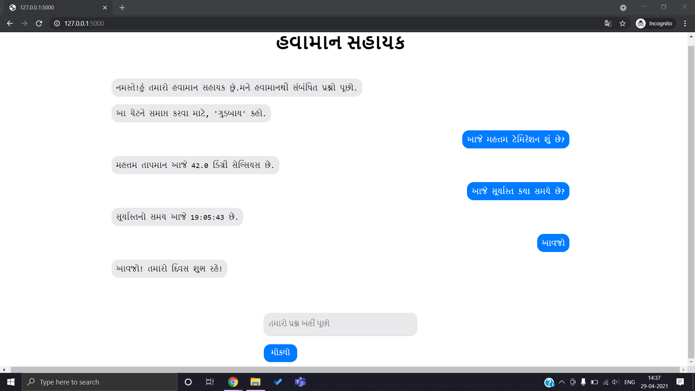

# Regional Language Weather Chatbot
This is a simple weather chatbot developed to address users' weather related queries in Gujarati language (one of the many regional languages of India). The chatbot is developed using Python, making use of packages such as NLTK (for natural language processing), PyOWM (for getting weather information from OpenWeatherMap API), and googletrans (for translating user input and output).

Users can ask simple weather related queries such as "What is the weather today?" in Gujarati and the chatbot answers the query with appropriate information.

The chatbot can be set to handle user queries in any language, simply by changing the variable for target language (target_lang; currently set to 'gu' for Gujarati) in the code.

### User Interface

---

Pratham Sharma

Student at Vellore Institute of Technology, Vellore, Tamil Nadu, India

Reach out to me: prathams2425@gmail.com

LinkedIn profile: https://www.linkedin.com/in/pratham-sharma-620418178/

Kaggle profile: https://www.kaggle.com/prathamsharma123
